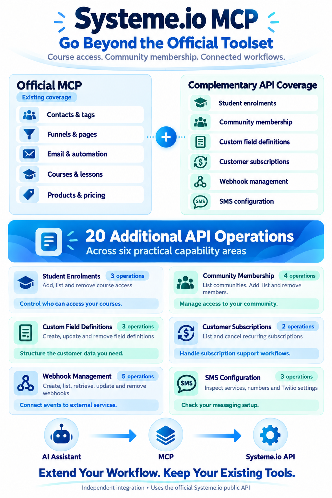

# Systeme.io MCP Server: Use AI to Automate Sales Funnels, Email Marketing and CRM

**Manage student access, community members and customer subscriptions with your AI assistant.**

Use AI to carry out supported sales funnel, email marketing and customer-management tasks with the **official Systeme.io MCP**, then add **Systeme.io Extra MCP** for course access, community membership, custom contact fields, customer subscriptions, event notifications and SMS configuration checks.

The title describes this combined setup. This independent companion does not itself build funnels, send email campaigns or provide a complete CRM. Here, automation means asking a connected assistant to perform supported actions; it does not mean an unattended business that runs without your instructions or review.

Systeme.io Extra MCP connects its additional account actions to assistants such as Claude, Codex, Antigravity and Cursor. Start with the [official Systeme.io MCP overview](https://systeme.io/mcp) for the wider platform capabilities, then use the comparison below to decide whether you need this companion.

Built by SoftReviewed. Independent project; not endorsed by Systeme.io.



## Guide

- [What you can do](#what-you-can-do)
- [Official Systeme.io MCP or this companion?](#official-systemeio-mcp-or-this-companion)
- [Is it right for you?](#is-it-right-for-you)
- [Connect Systeme.io to Claude, Codex, Antigravity or Cursor](#connect-your-assistant)
- [Technical reference](#technical-reference)
- [Troubleshooting](#troubleshooting)
- [Verification limits](#verification-limits)

## Why use it?

A customer needs access to a course. A community member needs to be removed. Someone wants their recurring purchase cancelled at the end of the billing period.

This companion makes those supported actions available to your assistant, so you can describe the outcome you want and review the proposed change before it is sent to Systeme.io. It brings six groups of features together in one connection, with 20 underlying actions.

**Your request -> assistant finds the right record -> previews the change -> you authorize it -> account updated.**

An assistant still needs accurate instructions and your review. The connection does not replace your judgement or guarantee that an assistant selects the right customer.

## What you can do

| What you need | What this companion can do | Important limit |
|---|---|---|
| Give a customer access to a course | Add access, inspect existing access or remove it | The contact and course must already exist; it does not create lessons or refund a sale |
| Manage a customer community | Find communities, add contacts, inspect members or remove membership | It does not create the community or moderate posts |
| Organize the information you collect | Create, rename or remove custom customer-information fields | It defines the fields; it does not fill in each customer's answers |
| Help a recurring-payment customer | Find their subscriptions and cancel a selected purchase immediately or at period end | It does not refund payments or cancel your own Systeme.io account plan |
| Notify another service about account events | Add, inspect, edit, pause or remove event notifications called webhooks | You need a separate service to receive and process those notifications |
| Check why SMS is not ready | Inspect the connected Twilio account, messaging services and sender numbers | Twilio must be connected; these tools do not send SMS |

### Course creators: keep student access organized

Ask: **"Show who has access to this course, then preview giving this customer access."**

You can grant full access, access to selected modules or a supported drip-access type. The course's teaching schedule and content are still managed in Systeme.io.

If you are learning the platform first, our [Systeme.io course](https://pricing-discount.systeme.io/courses) guide helps you compare the two free certification paths before you start managing real students.

### Community owners: manage who can join

Ask: **"Find my customer community and preview adding this existing contact."**

The assistant can inspect memberships before making a change, helping you distinguish a customer record from their community access. Membership management is separate from creating a community or moderating conversations.

### Customer support: choose the right cancellation timing

Ask: **"Find this customer's recurring purchase and preview cancellation at the end of the billing period."**

The two supported choices are immediate cancellation or cancellation when the billing period ends. Confirm which purchase and timing the customer wants. Neither choice is a refund.

### Business owners: connect events and diagnose SMS

Ask: **"Show my existing event notifications and preview pausing this receiver."** Or: **"Check whether my Twilio integration is configured."**

Event notifications can tell your own connected service about supported contact, tag, opt-in and sale events. SMS checks help inspect configuration; they do not establish a messaging campaign or send texts.

## Official Systeme.io MCP or this companion?

**Use them together when you need both sets of features.** This companion focuses on additional account actions rather than rebuilding everything the official connector already does.

| Your goal | Official connected integration | Systeme.io Extra MCP |
|---|---|---|
| Use supported page, funnel, email, product and course-creation tools | Existing tools in the inspected inventory | Use the official integration for these |
| Manage course enrolments | These three actions were absent from the inspected inventory | Add, list and remove access |
| Manage community membership | These four actions were absent | Find communities; add, list and remove membership |
| Define custom contact fields | Contact-value updates were already covered; these definition actions were absent | Create, rename and remove definitions |
| Inspect/cancel customer recurring purchases | These two actions were absent | List by customer and cancel a selected subscription |
| Manage event notifications | These five actions were absent | Create, list, inspect, edit and remove receivers |
| Inspect Twilio configuration | SMS template tools existed; these three configuration reads were absent | Inspect services, numbers and connected account |

Comparison checked against the connected official tool inventory on **6 October 2026**. It describes that inventory, not a permanent claim about every official integration or future release.

## Is it right for you?

### Advantages

- **Useful extra account actions:** manage access and recurring purchases through a compatible assistant.
- **One connection across supported local assistants:** Docker Gateway runs the same companion for Claude, Codex, Antigravity or Cursor.
- **Preview before changing account data:** see a proposed operation before an authorized write.
- **Credentials stay out of client configuration:** keep the API key in Docker's secret store.
- **Portable setup:** rebuild the image and recreate your secret when moving computers, without a developer-specific folder mount.

### Trade-offs and limitations

- **Initial setup is technical.** You need Docker Gateway and a Systeme.io public API key. Your assistant or a technical helper can follow the setup instructions below.
- **Not every feature is tested live.** Selected reads passed; writes were validated locally, and successful connected-Twilio responses remain untested. See [verification limits](#verification-limits).
- **Your account's limits still apply.** It does not unlock paid features, increase capacity or bypass permissions.
- **No built-in cloud hosting.** The supplied connection runs locally; a cloud-only assistant needs a separately hosted, authenticated connection.
- **It is a companion, not the whole platform.** Keep the official connector and dashboard for features outside its scope.

If you only need features already provided by the official integration, you may not need this companion. If one of the extra actions solves an actual workflow problem, start with a harmless read and preview before making changes.

## New to Systeme.io?

You need a Systeme.io account before this companion can work with your data. [Create a free Systeme.io account](https://systeme.io/?sa=sa014961805313a1b0df13d9b881e5c0c4563dda8f), then learn the dashboard before connecting an assistant to customer records.

For a small starting project, read our [Systeme.io free-plan features and limits guide](https://pricing-discount.systeme.io/free-plan-lifetime-deal). If you later need more capacity, compare the [Systeme.io pricing plans](https://pricing-discount.systeme.io/plan-pricing) and our explanation of [annual discounts and savings](https://pricing-discount.systeme.io/). A higher plan should solve a real capacity need; installing this MCP does not itself require you to upgrade.

If your goal is to build funnels for yourself or clients, our [Systeme.io Funnel Builder certification guide](https://www.linkedin.com/pulse/systemeio-funnel-builder-certification-free-course-beginners-george-8s71f/) covers that learning path. You can also [compare the two Systeme.io certification courses](https://pricing-discount.systeme.io/courses) before choosing where to start.

You can also visit [SoftReviewed](https://softreviewed.com/) for additional resources.

**Affiliate disclosure:** SoftReviewed may earn a commission from eligible purchases made through its referral links. This does not make the MCP an official Systeme.io product.

## Let your assistant handle the setup details

Share this repository URL with your assistant and ask:

> Read the README and setup files. Explain which features fit my task, inspect my existing Docker Gateway configuration, and help connect this companion without replacing my other servers. Start with help and a harmless read. Do not make account changes without my authorization.

An assistant can read the instructions, but it still needs access to your local setup to configure it. Never put your API key into a public issue or commit.

The remaining sections are for installation and technical reference. Exact action names, required inputs and edge cases are in the [detailed feature reference](docs/feature-reference.md); copyable requests are in [the operation examples](examples/operations.json).

## Connect your assistant

Assistant -> Docker Gateway -> container -> official Systeme.io API.

### Portable catalog setup

Install/start Docker Desktop with MCP Toolkit/Gateway available. From this repository, check the CLI and build the image:

```sh
docker version
docker mcp gateway run --help
docker build -t mcp-systeme-extra:v1 .
```

The image includes its source and schemas; clients need no source-folder mounts or local Python installation. Copy `docker-catalog.yaml` to `~/.docker/mcp/catalogs/systeme-extra.yaml` (Windows: `%USERPROFILE%\.docker\mcp\catalogs\systeme-extra.yaml`), creating the folder if needed.

```powershell
New-Item -ItemType Directory -Force "$env:USERPROFILE\.docker\mcp\catalogs" | Out-Null
Copy-Item -LiteralPath .\docker-catalog.yaml -Destination "$env:USERPROFILE\.docker\mcp\catalogs\systeme-extra.yaml"
```

Check discovery:

```sh
docker mcp gateway run --catalog systeme-extra.yaml --servers systeme-extra --dry-run
```

Expected: six tools. Explicit `--servers` selects this server without relying on the enabled-server registry. For an existing shared Gateway, merge the catalog entry, preserve other servers and reuse the existing client connection instead of adding duplicates.

The catalog workflow was tested with the installed CLI. Newer Docker Toolkit profile workflows may differ; inspect your installed `docker mcp gateway run --help`. [Docker MCP documentation](https://docs.docker.com/ai/mcp-catalog-and-toolkit/).

### Credentials

Create a **public API key** in your Systeme.io API-key settings; the official MCP credential is not a substitute for this REST API credential. Store it as Docker secret `systeme.api_key`, injected as `SYSTEME_API_KEY`.

PowerShell input avoids placing the key in command history:

```powershell
$systemeSecureKey = Read-Host "Systeme.io public API key" -AsSecureString
$systemeKeyPointer = [Runtime.InteropServices.Marshal]::SecureStringToBSTR($systemeSecureKey)
try {
    [Runtime.InteropServices.Marshal]::PtrToStringBSTR($systemeKeyPointer) | docker mcp secret set systeme.api_key
} finally {
    [Runtime.InteropServices.Marshal]::ZeroFreeBSTR($systemeKeyPointer)
    Remove-Variable systemeSecureKey, systemeKeyPointer
}
```

No credentials belong in client JSON or Git. The temporary verification key and its Docker secret were removed; your installation needs its own key. Help and previews work without credentials; account requests do not.

### Claude Desktop

To connect Systeme.io to Claude Desktop using this companion, configure the local Docker Gateway entry below. This is separate from the official hosted Systeme.io connector.

Settings -> Developer -> Edit Config. Merge [claude-desktop.json](examples/clients/claude-desktop.json), then fully restart the app.

Windows config: `%APPDATA%\Claude\claude_desktop_config.json`. macOS: `~/Library/Application Support/Claude/claude_desktop_config.json`. [Official local-server guide](https://modelcontextprotocol.io/docs/develop/connect-local-servers).

```json
{
  "mcpServers": {
    "systeme-extra": {
      "command": "docker",
      "args": ["mcp", "gateway", "run", "--catalog", "systeme-extra.yaml", "--servers", "systeme-extra"]
    }
  }
}
```

### Claude Code

```sh
claude mcp add --transport stdio --scope user systeme-extra -- docker mcp gateway run --catalog systeme-extra.yaml --servers systeme-extra
claude mcp list
```

Use `/mcp` to inspect status. Project-only configurations belong in `.mcp.json` rather than a user-level connection. [Claude Code documentation](https://code.claude.com/docs/en/mcp).

### Codex

```sh
codex mcp add systeme-extra -- docker mcp gateway run --catalog systeme-extra.yaml --servers systeme-extra
codex mcp list
```

Alternatively merge [codex.toml](examples/clients/codex.toml) into `~/.codex/config.toml`:

```toml
[mcp_servers.systeme_extra]
command = "docker"
args = ["mcp", "gateway", "run", "--catalog", "systeme-extra.yaml", "--servers", "systeme-extra"]
startup_timeout_sec = 60
```

Reload the local app/extension; `/mcp` shows CLI status. Hosted ChatGPT web does not read this local configuration. [Codex MCP documentation](https://developers.openai.com/codex/mcp/).

### Google Antigravity

MCP Servers -> Manage MCP Servers -> View raw config. Merge [antigravity.json](examples/clients/antigravity.json), using the same `mcpServers` entry as Claude Desktop.

Current documented paths: global `~/.gemini/config/mcp_config.json`, project `.agents/mcp_config.json`. Reload/check tools. Paths and menus vary by release; use the file opened by your installed app. [Antigravity documentation](https://antigravity.google/docs/mcp).

### Cursor

Merge [cursor.json](examples/clients/cursor.json) into global `~/.cursor/mcp.json` or project `.cursor/mcp.json`, then reload/check MCP status.

```json
{
  "mcpServers": {
    "systeme-extra": {
      "type": "stdio",
      "command": "docker",
      "args": ["mcp", "gateway", "run", "--catalog", "systeme-extra.yaml", "--servers", "systeme-extra"]
    }
  }
}
```

[Cursor documentation](https://prod.cursor.com/docs/mcp).

### Other local clients / cloud hosting

For another stdio client, use command `docker` with the same arguments. If Docker cannot be found, use its absolute executable path from `Get-Command docker` (Windows) or `command -v docker` (macOS/Linux). Merge configurations without replacing other servers.

**This repository does not provide a hosted MCP URL.** Cloud-only assistants cannot start your computer's Docker process. Remote access requires a separately deployed, authenticated Gateway/transport and compatible client; local JSON is not a cloud deployment recipe. Do not expose an unauthenticated Gateway publicly.

## Technical reference

The additional operations are based on [Systeme.io's public API documentation](https://developer.systeme.io/llms.txt). Use it to verify supported endpoints alongside the checked-in schemas and examples.

### Common arguments

| Argument | Meaning | Default |
|---|---|---|
| `action` | Operation, or `help` for exact schemas | `help` |
| `parameters` | Path IDs and query filters | Empty |
| `body` | Payload for operations that accept one | Empty |
| `dry_run` | Validate/preview without requesting the API | `false` |
| `confirm` | Permit a write after human authorization | `false` |

Workflow: help -> find real IDs -> preview -> user authorizes -> execute -> verify. `confirm:true` is a server guard, not evidence of human permission. All write examples in [examples/operations.json](examples/operations.json) are previews; execute an authorized write by replacing `dry_run:true` with `confirm:true`. Replace example IDs with actual selected records.

### Implementation

| Detail | Behavior |
|---|---|
| Runtime | Python 3.11 image; FastMCP 2.14.2 |
| Dependencies | Docker installs pinned `requirements-lock.txt` |
| Transport | Server stdio through Gateway |
| Authentication | `https://api.systeme.io`; `X-API-Key` header |
| HTTP | httpx; 30-second timeout; redirects disabled |
| Validation | Official schemas; unknown fields rejected; path IDs URL-encoded |
| Writes | POST/PATCH/DELETE guarded; PATCH uses `application/merge-patch+json` |
| Retries | No automatic retries, including writes |
| Output | API data preserved; sensitive field names redacted recursively |

Enrolments, communities, memberships and customer subscriptions support `limit` (10-100), `order` (`asc`/`desc`) and integer `startingAfter` (>=1). When the collection reports more results, use the last item's ID as the next cursor, preserving filters/order. No automatic all-page retrieval. Webhook/SMS schemas expose no such query inputs.

Success includes `ok`, `status`, `data`, `rate_limit_remaining`. HTTP errors include `ok:false`, `status`, documented explanation, and `retry_after` when returned. No fixed API allowance is promised. A timeout does not prove a write failed: inspect account state before retrying.

Redaction is field-name based, not complete removal of personal data. Do not share customer outputs publicly. All 20 method/path pairs and original schemas/source URLs are in [docs/operations.json](docs/operations.json); copyable inputs are in [examples/operations.json](examples/operations.json).

### Endpoint map

| Action | Method | Official API path |
|---|---|---|
| enrolments.create | POST | `/api/school/courses/{courseId}/enrollments` |
| enrolments.list | GET | `/api/school/enrollments` |
| enrolments.remove | DELETE | `/api/school/enrollments/{id}` |
| communities.list | GET | `/api/community/communities` |
| communities.add_member | POST | `/api/community/communities/{communityId}/memberships` |
| communities.list_members | GET | `/api/community/memberships` |
| communities.remove_member | DELETE | `/api/community/memberships/{id}` |
| contact_fields.create | POST | `/api/contact_fields` |
| contact_fields.remove | DELETE | `/api/contact_fields/{slug}` |
| contact_fields.update | PATCH | `/api/contact_fields/{slug}` |
| subscriptions.list | GET | `/api/payment/subscriptions` |
| subscriptions.cancel | POST | `/api/payment/subscriptions/{id}/cancel` |
| webhooks.list | GET | `/api/webhooks` |
| webhooks.create | POST | `/api/webhooks` |
| webhooks.get | GET | `/api/webhooks/{id}` |
| webhooks.remove | DELETE | `/api/webhooks/{id}` |
| webhooks.update | PATCH | `/api/webhooks/{id}` |
| sms.services | GET | `/api/sms/message-services` |
| sms.numbers | GET | `/api/sms/phone-numbers` |
| sms.twilio_account | GET | `/api/sms/twilio-account` |

## Troubleshooting

| Symptom | Next step |
|---|---|
| Docker not found | Start Desktop; use absolute executable path |
| No tools | Check image tag, catalog path and server name |
| Duplicate tools | Reuse the existing Gateway connection |
| `configured:false` | Store Docker secret; missing/`<UNKNOWN>` keys cannot authenticate |
| HTTP 401 / 403 | Check public API key and permissions |
| Invalid input | Use help; verify spelling, types and required fields |
| Partial access rejected | Supply a non-empty integer `modules` array |
| Subscription list cannot run | Find a real contact ID first |
| SMS 424 / account 404 | Connect Twilio; documented missing-integration responses |
| HTTP 429 | Respect returned retry/rate-limit information |
| Write timed out | Check account state before retrying |
| Source edits invisible | Rebuild image and restart client/Gateway |

## Verification limits

| Check | Status, 6 October 2026 |
|---|---|
| Local tests | 15 passed; all 20 previews and mocked HTTP behavior |
| Docker Gateway | Six tools, all help calls and enrolment preview passed |
| Authenticated reads | Enrolment, community, membership and webhook lists returned 200 |
| Missing Twilio | Documented 424 / 424 / 404 confirmed |
| Successful connected Twilio | Not tested |
| Subscription operations | No real contact/subscription test resource available |
| Live writes | Not performed; local validation only |
| Individual assistant apps | Configs checked against documentation; not all tested in-app |

See [full verification details](docs/verification.md). Account permissions and product restrictions still apply.

### Development and portability

Create a Python 3.11 virtual environment:

```sh
python -m venv .venv
```

Activate with `.venv\Scripts\Activate.ps1` on Windows or `source .venv/bin/activate` on macOS/Linux, then run:

```sh
python -m pip install -r requirements-lock.txt
python -m unittest -v
python tests/gateway_smoke.py
```

The smoke test uses this repository catalog by default and sends no account API requests. Override its catalog with `SYSTEME_EXTRA_CATALOG` if needed. The separate live-read script requires credentials.

Moving computers: repository -> build image -> install catalog -> recreate Docker secret securely -> merge client config -> check help and a harmless read. Copying the repository does not transfer credentials. No developer-specific source mount is needed.
